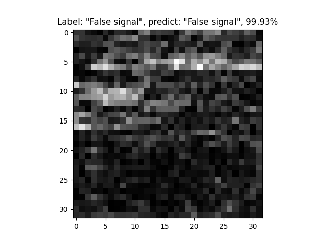

# Classify correlation signals using CNN

Scripts for training, converting and testing convolutional neural network for correlation signals classifying.
Scripts are based on my small keras-tf-cv-library https://gitlab.com/_chiffa_/cv_utils (sorry if you don't have access).

See training parameters in `config.py`.

## 1. Dataset preparation

Use https://github.com/Chifffa/correlation_pattern_recognition to make full modeling and save correlation matrices.
For example, use following code:
```python
import os

from cpr import CorrelationPatternRecognition, update_config, parse_yaml_config

config = parse_yaml_config(os.path.join('data', 'config.yml'))
basic_config, default_config = config['basic'], config['default']

config = update_config(basic_config, default_config, ..., save_data=True)
cpr_object = CorrelationPatternRecognition(basic_config)
cpr_object.work('full_dataset_name', [config])
```
By default, all results will be saved in `results/Config000_current_date`.

After modelling, run this script:
```shell script
python prepare_data.py path/to/results/Config000_current_date
```
Use additional parameters if your data is special (i.e. obtained using holograms).

True and false signals respectively looks like this:


## 2. Training
Run training script with default parameters:
```shell script
python train.py
```
Or run this to see all training parameters:
```shell script
python train.py --help
```

## 3. Converting
Use this to convert trained model to frozen tf 1.x graph and onnx model:
```shell script
python convert.py --weights path/to/weights.h5
```

## 4. Testing
Evaluate loss and metrics (only keras .h5 weights) on testing data:
```shell script
python validate.py evaluate --weights path/to/weights.h5
```
Test model (any type of weights) performance and get metrics via
sklearn.classification_report:
```shell script
python validate.py validate --weights path/to/weights.pb
```
Visualize model predictions on testing data:
sklearn.classification_report (any type of weights):
```shell script
python validate.py predict --weights path/to/weights.onnx
```
Or run this to see all validating parameters:
```shell script
python validate.py --help
```

## Current results

### custom_resnet18

```
Testing model "custom_model_best_041_epoch.h5".

Train data:
loss = 0.0257; recall = 0.9977; precision = 0.9980; F1_score = 0.9978

Test data:
loss = 0.5292; recall = 0.9082; precision = 0.9281; F1_score = 0.9114
```

```
Using model "custom_model_best_041_epoch.h5". Using gpu: None.
Mean inference time: 0.0032. Mean FPS: 315.4376.
              precision    recall  f1-score   support

 True signal       0.97      0.84      0.90      2880
False signal       0.88      0.98      0.93      3520

    accuracy                           0.92      6400
   macro avg       0.93      0.91      0.91      6400
weighted avg       0.92      0.92      0.92      6400
```

Prediction examples:




## Cite

This work is described in this article https://arxiv.org/abs/2004.09430.
Please cite us if you use this project in your work. Thank you!
```
@misc{goncharov2020improving,
      title={Improving correlation method with convolutional neural networks}, 
      author={Dmitriy Goncharov and Rostislav Starikov},
      year={2020},
      eprint={2004.09430},
      archivePrefix={arXiv},
      primaryClass={cs.CV}
}
```
